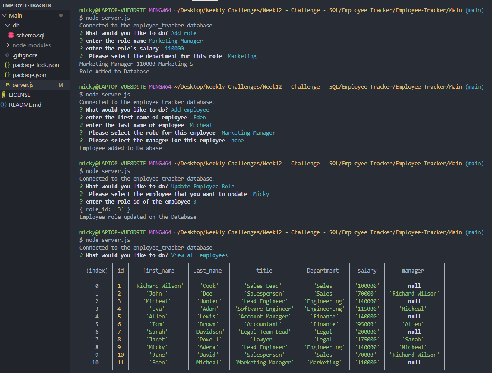

# Employee Database Tracker
A command-line application from scratch to manage a company's employee database, using Node.js, Inquirer, and MySQL.
# Features for the App 
-----------------------------------------------------------------------  
-	A command-line application that accepts user input.

-	User is presented with the following options: view all departments, view all roles, view all employees, add a department, add a role, add an employee, and update an employee role.

-	When user choose to view all departments, the App presents a formatted table showing department names and department ids.

-	When user choose to view all roles, the App presents the job title, role id, the department that role belongs to, and the salary for that role.

-	When user choose to view all employees, they are presented with a formatted table showing employee data, including employee ids, first names, last names, job titles, departments, salaries, and managers that the employees report to.

-	When user choose to add a department, they are prompted to enter the name of the department and that department is added to the database

-	When user choose to add a role, they are prompted to enter the name, salary, and department for the role and that role is added to the database.

-	When user choose to add an employee, they are prompted to enter the employee’s first name, last name, role, and manager, and that employee is added to the database.

-	When user choose to update an employee role, they are prompted to select an employee to update, and their new role and this information is updated in the database.

# Built with
-----------------------------------------------------------------------
 - Node.js
- Inquirer
- MySQL

# Links
-----------------------------------------------------------------------
### [Demonstration Video](https://youtu.be/j9wPerrACYw)
### [Repository](https://github.com/Micky-Ad/Employee-Tracker)

# Screenshot:
----------------------------------------------------------------------
 
 
 

# Usage:
----------------------------------------------------------------------
Company employee’s database tracker and manager

# License:
-----------------------------------------------------------------------
[MIT](https://choosealicense.com/licenses/mit/)
